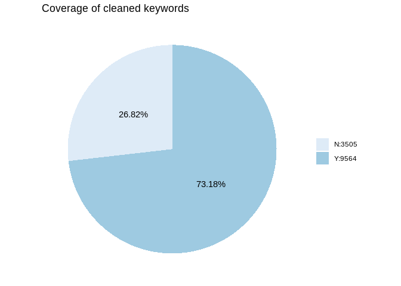
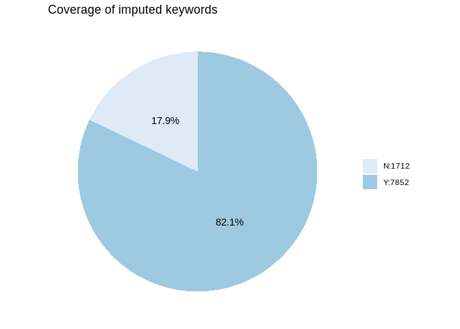
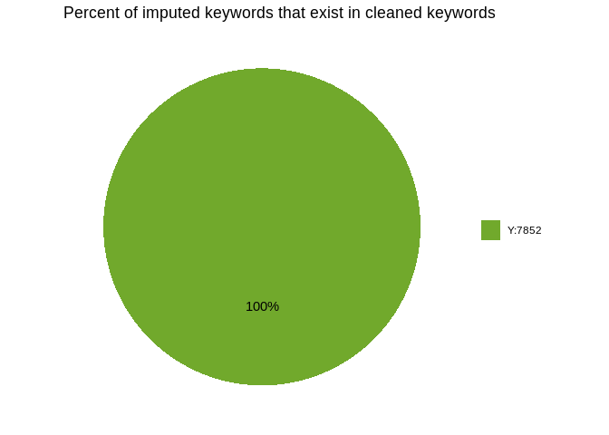
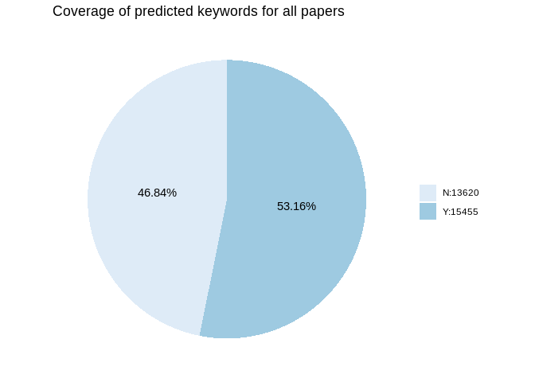

+++
title = "Content Analysis"
menuTitle = "2.2 Content Analysis"
weight = 8
+++
## Title Analysis: Keyword Prediction

Although most of the articles have keywords with them, there are still
quite a lot of articles without keywords. Meanwhile, some articles may
have complicated keywords, which could also increase the difficulty of
analysis. To solve this problem, we can try to predict the keywords with
title analysis techniques.

In the following parts, the keyword prediction using the results from
previous keyword analysis will be demonstrated.

## Pre-prepare: Include packages and source data

We will mainly use the package [quanteda](https://quanteda.io/) for our
analysis. Quanteda is an R package for managing and analyzing textual
data. It is designed for R users needing to apply natural language
processing to texts, from documents to final analysis.  
{}

    library(tidyverse)
    library(tidytext)
    library(dplyr)
    library(XML)
    library(knitr)
    library(tm)
    library(corpus)
    library(quanteda)
    library(readxl)
    library(topicmodels)
    library(textstem)

    rm(list = ls())

    set.seed(1234)
    #Load data
    paper <- read_excel("~/tm/app-1/new_kw.xlsx")

{}

## Pre-prepare: Including data and building dictonary

In our analysis, we will use topic-specific dictionaries. Topic-specific
dictionaries is a method somehow similar to [sentiment
analysis](https://en.wikipedia.org/wiki/Sentiment_analysis). Its aim is
to determine the polarity of a text, which could be done by counting
terms that were previously assigned to the given categories. With this
method, we can categorize the given titles into specific keywords in our
dictionary.

To use topic-specific dictionaries, the keyword corpus and dictionary
need to be built in advance.  
{}

    #Build keyword corpus
    paper2 <- paper %>%
      select(title, keyword) %>%
      mutate(keyword2 = lemmatize_strings(str_to_lower(keyword))) 
    corp_k <- corpus(paper2, text_field = 'keyword2')
    token_k <- quanteda::tokens(corp_k, remove_numbers = TRUE, remove_punct = TRUE, remove_symbols = TRUE)

    #Build dictionary based on keyword analysis result
    dict <- list(
      output_delivery_system = c('output','delivery','system'),
      hash_object = c('hash','object'),
      machine_learing = c('machine','learing'),
      dictionary_table = c('dictionary','table'),
      cdisc = c('cdisc','adam','sdtm','xml','domain','send'),
      multisheet_workbook = c('multi','sheet','workbook','excel'),
      business_intelligence = c('business','intelligence'),
      call_execute = c('call','execute'),
      repeated_measures = c('repeat','measures'),
      tagset = c('excelxp', 'tageset'),
      logistic_regression = c('logistic', 'regression'),
      time_series = c('time','series'),
      sas_af = c('sas','af'),
      sas_viya = c('sas','viya'),
      sas_internet = c('sas','internet'),
      sas_base = c('sas','base'),
      sas_graph = c('sas', 'visual', 'analytics','graph'),
      sas_consult = c('sas', 'consult', 'consultant'),
      sas_enterprise = c('sas', 'enterprise','guide','miner'),
      ods = c('ods','rtf','graphics','microsoft','od'),
      macro = c('macro'),
      array = c('array'),
      healthcare = c('healthcare'),
      format = c('format'),
      html = c('html'),
      global_forum = c('global','forum'),
      proc_sql = c('proc','sql'),
      proc_report = c('proc','report'),
      proc_template = c('proc','template','sasgf'),
      proc_tabulate = c('proc','tabulate'),
      clinical_trial = c('clinical','trial'),
      survival_analysis = c('survival','analysis'),
      data_warehouse = c('datum','warehouse'),
      data_mining = c('datum','mining'),
      data_management = c('datum','management'),
      data_integration = c('datum','integration'),
      data_quality = c('datum','quality','clean'),
      data_visualization = c('datum','visualization'),
      project_management = c('project','management')
    )

    lexicon <- dictionary(dict)

{}

## Keyword Cleaning

We will calculate the keyword coverage from source data first. In this
study, the keyword coverage is defined as the percent of papers with any
keyword existing after imputation. Keyword cleaning is performed before
the calculation.  
{}

    #Clean Keyword
    dfm_k <- dfm(token_k) %>% 
      dfm_remove(c(stopwords("english"),'â','sas','datum')) %>%
      dfm_group(groups = docvars(token_k)[,"title"]) %>%
      dfm_lookup(dictionary = lexicon) 

    dfm.prop.k <- dfm_weight(dfm_k, scheme = "prop")
    df.prop.k <- convert(dfm.prop.k, "data.frame")

    ncol_k <- ncol(df.prop.k)

    for (i in 1:nrow(df.prop.k)){
      df.prop.k[i,'max'] <- max(df.prop.k[i,c(seq(2, ncol_k))])
      df.prop.k[i,'keyword_cleaned'] <- ''
      
      for (j in 2:ncol_k){
        if (df.prop.k[i, j] == df.prop.k[i,'max'] & df.prop.k[i,'max'] != 0){
          df.prop.k[i,'keyword_cleaned'] <- paste(df.prop.k[i,'keyword_cleaned'], colnames(df.prop.k)[j])
        }
      }
    }

    #cleaned keyword coverage
    paper3 <- paper2 %>%
      inner_join(df.prop.k, by=c('title' = 'doc_id')) %>%
      select(title, keyword2, keyword_cleaned) %>%
      mutate(null = ifelse(keyword_cleaned == '' & grepl('kb', keyword2), 'Y', 'N'),
             coverage = ifelse(keyword_cleaned == "", "N", "Y")) %>%
      filter(null == 'N')

    fail <- paper3 %>% 
      filter(coverage == 'N') %>%
      group_by(keyword2) %>%
      summarise(n = n()) %>%
      arrange(desc(n))

    cov_clean <- paper3 %>%
      group_by(coverage) %>%
      summarise(n = n()) %>%
      ungroup() %>%
      mutate(percentage = round(n/sum(n)*100,2)) %>%
      mutate(lab1=paste(coverage , n,sep=':'))#Coverage:73.18% of 13072

    ggplot(cov_clean, aes(x='',y=n,fill=lab1)) +
      geom_bar (stat="identity", width=1) + 
      coord_polar ("y", start=0) +
      geom_text(aes(label = paste0(percentage, "%")), position = position_stack(vjust=0.5))+
      labs(x = NULL, y = NULL, fill = NULL,title="Coverage of cleaned keywords") + 
      theme_classic() +
      theme(axis.line = element_blank(),
              axis.text = element_blank(),
              axis.ticks = element_blank()
            ) +
      scale_fill_brewer(palette="Blues")

{}  
   

Approximately 73.18% of the papers have cleaned keyword coverage.

## Keyword Imputation

Next, we will use our dictionary to impute the keyword from the titles.
Similarly, the coverage of the imputed keyword will be calculated. Also,
we will calculate the accuracy of the imputation by comparing the
imputed results with cleaning results. The accuracy here is defined as
the percentage of papers where the cleaned keywords exist in the imputed
keywords for all the papers imputed.  
{}

    #Build title corpus
    paper4 <- paper3 %>% 
      filter(coverage == 'Y') %>%
      mutate(title2 = lemmatize_strings(str_to_lower(title))) 

    corp_t <- corpus(paper4, text_field = 'title2')
    token_t <- quanteda::tokens(corp_t, remove_numbers = TRUE, remove_punct = TRUE, remove_symbols = TRUE)

    #Impute Keyword
    dfm_t <- dfm(token_t) %>% 
      dfm_remove(c(stopwords("english"),'â','sas','datum')) %>%
      dfm_group(groups = docvars(token_t)[,"title"]) %>%
      dfm_lookup(dictionary = lexicon) 

    dfm.prop.t <- dfm_weight(dfm_t, scheme = "prop")
    df.prop.t <- convert(dfm.prop.t, "data.frame")

    ncol_t <- ncol(df.prop.t)

    for (i in 1:nrow(df.prop.t)){
      df.prop.t[i,'max'] <- max(df.prop.t[i,c(seq(2, ncol_t))])
      df.prop.t[i,'keyword_imputed'] <- ''
      
      for (j in 2:ncol_t){
        if (df.prop.t[i, j] == df.prop.t[i,'max'] & df.prop.t[i,'max'] != 0){
          df.prop.t[i,'keyword_imputed'] <- paste(df.prop.t[i,'keyword_imputed'], colnames(df.prop.t)[j])
        }
      }
    }

    #imputed keyword coverage
    paper5 <- paper4 %>%
      inner_join(df.prop.t, by=c('title' = 'doc_id')) %>%
      select(title, keyword_cleaned, keyword_imputed) %>%
      mutate(coverage = ifelse(keyword_imputed == "", "N", "Y")) 

    cov_imp <- paper5 %>%
      group_by(coverage) %>%
      summarise(n = n()) %>%
      ungroup() %>%
      mutate(percentage = round(n/sum(n)*100,2)) %>%
      mutate(lab1=paste(coverage , n,sep=':'))#Coverage:73.18% of 13072

    ggplot(cov_imp, aes(x='',y=n,fill=lab1)) +
      geom_bar (stat="identity", width=1) + 
      coord_polar ("y", start=0) +
      geom_text(aes(label = paste0(percentage, "%")), position = position_stack(vjust=0.5))+
      labs(x = NULL, y = NULL, fill = NULL, title="Coverage of imputed keywords") + 
      theme_classic() +
      theme(axis.line = element_blank(),
              axis.text = element_blank(),
              axis.ticks = element_blank()
            ) +
      scale_fill_brewer(palette="Blues")

    #imputed keyword accuracy 
    test <- paper5 %>%
      filter(coverage == 'Y') %>%
      mutate(result = keyword_cleaned %in% keyword_imputed,
             success = sum(result))

    cov_acc <- test %>%
      group_by(coverage) %>%
      summarise(n = n()) %>%
      ungroup() %>%
      mutate(percentage = round(n/sum(n)*100,2)) %>%
      mutate(lab1=paste(coverage , n,sep=':'))

    ggplot(cov_acc, aes(x='',y=n,fill=lab1)) +
      geom_bar (stat="identity", width=1) + 
      coord_polar ("y", start=0) +
      geom_text(aes(label = paste0(percentage, "%")), position = position_stack(vjust=0.5))+
      labs(x = NULL, y = NULL, fill = NULL,title="Percent of imputed keywords that exist in cleaned keywords") + 
      theme_classic() +
      theme(axis.line = element_blank(),
              axis.text = element_blank(),
              axis.ticks = element_blank()
            ) +
      scale_fill_manual(values='#71A92C')

{}  

   
Approximately 82.1% of the papers have keyword coverage after
imputation. Also, we can find that all the imputed keywords are within
cleaned keywords.

## Keyword Prediction

Finally, we try to use the dictionary to predict the keyword of all the
papers we collected.  
{}

    #Prediction
    paper_all <- read_excel("paper.xlsx")
    paper_pred <- paper_all %>% 
      anti_join(paper5, by = 'title') %>%
      mutate(title2 = lemmatize_strings(str_to_lower(title))) 

    corp_p <- corpus(paper_pred, text_field = 'title2')
    token_p <- quanteda::tokens(corp_p, remove_numbers = TRUE, remove_punct = TRUE, remove_symbols = TRUE)

    #Predict Keyword
    dfm_p <- dfm(token_p) %>% 
      dfm_remove(c(stopwords("english"),'â','sas','datum')) %>%
      dfm_group(groups = docvars(token_p)[,"title"]) %>%
      dfm_lookup(dictionary = lexicon) 

    dfm.prop.p <- dfm_weight(dfm_p, scheme = "prop")
    df.prop.p <- convert(dfm.prop.p, "data.frame")

    ncol_p <- ncol(df.prop.p)

    for (i in 1:nrow(df.prop.p)){
      df.prop.p[i,'max'] <- max(df.prop.p[i,c(seq(2, ncol_p))])
      df.prop.p[i,'keyword_predict'] <- ''
      
      for (j in 2:ncol_p){
        if (df.prop.p[i, j] == df.prop.p[i,'max'] & df.prop.p[i,'max'] != 0){
          df.prop.p[i,'keyword_predict'] <- paste(df.prop.p[i,'keyword_predict'], colnames(df.prop.p)[j])
        }
      }
    }

    #predict keyword coverage
    paper_pred <- paper_pred %>%
      inner_join(df.prop.p, by=c('title' = 'doc_id')) %>%
      mutate(coverage = ifelse(keyword_predict == "", "N", "Y")) 

    cov_pred <- paper_pred %>%
      group_by(coverage) %>%
      summarise(n = n()) %>%
      ungroup() %>%
      mutate(percentage = round(n/sum(n)*100,2)) %>%
      mutate(lab1=paste(coverage , n,sep=':'))#Coverage:73.18% of 13072

    ggplot(cov_pred, aes(x='',y=n,fill=lab1)) +
      geom_bar (stat="identity", width=1) + 
      coord_polar ("y", start=0) +
      geom_text(aes(label = paste0(percentage, "%")), position = position_stack(vjust=0.5))+
      labs(x = NULL, y = NULL, fill = NULL,title="Coverage of predicted keywords for all papers") + 
      theme_classic() +
      theme(axis.line = element_blank(),
              axis.text = element_blank(),
              axis.ticks = element_blank()
            ) +
      scale_fill_brewer(palette="Blues")

 {}  
  

After predicting keywords using our dictionary model, the predicted
keyword coverage of all the papers is approximately 53.16%.

## Further Explorations and conclusion

Our exploration indicates that dictionary model could be useful when
keywords are not presented. After prediction with the model, the
keywords of more than half of the papers could be imputed. Moreover, the
dictionary used in our study is relatively crude. With a better
dictionary, the coverage could be even higher.  
Besides, we also tried to use [Latent Dirichlet
Allocation(LDA)](https://en.wikipedia.org/wiki/Latent_Dirichlet_allocation)
to perform a topic modeling analysis. However, because the number of
words in a title is relatively small, we did not get a satisfying
result.

Other methods may also be applied in the topic analysis, such as
supervised machine learning. If you are interested, have a try!
