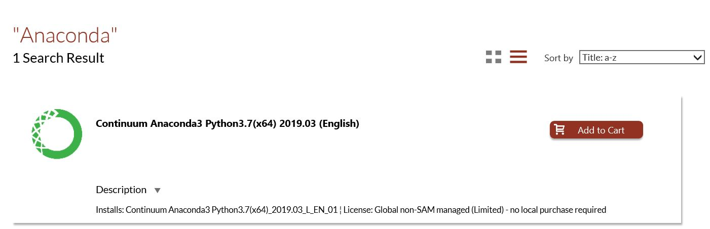
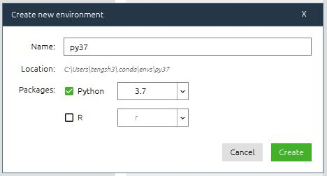
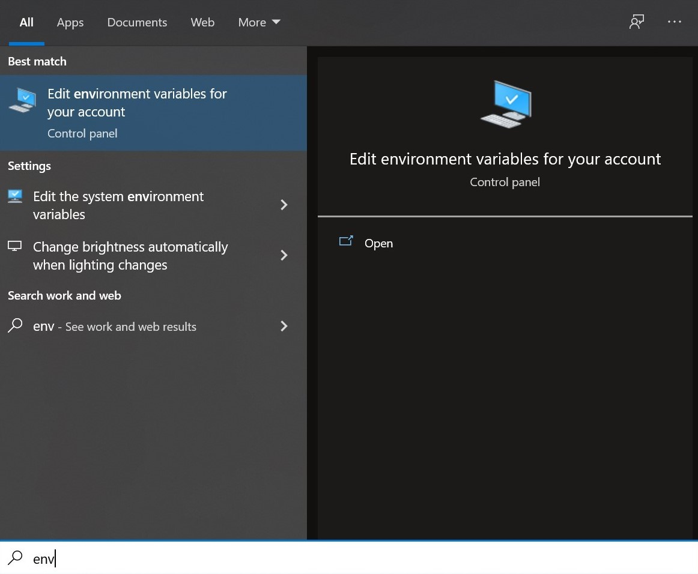
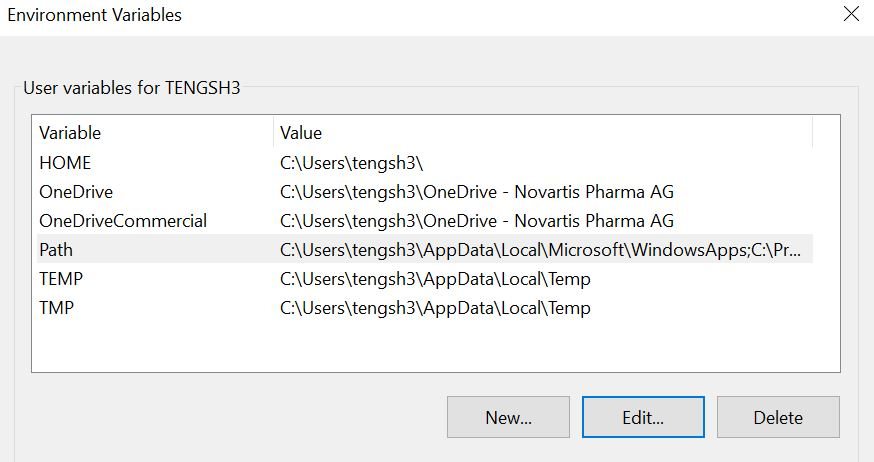
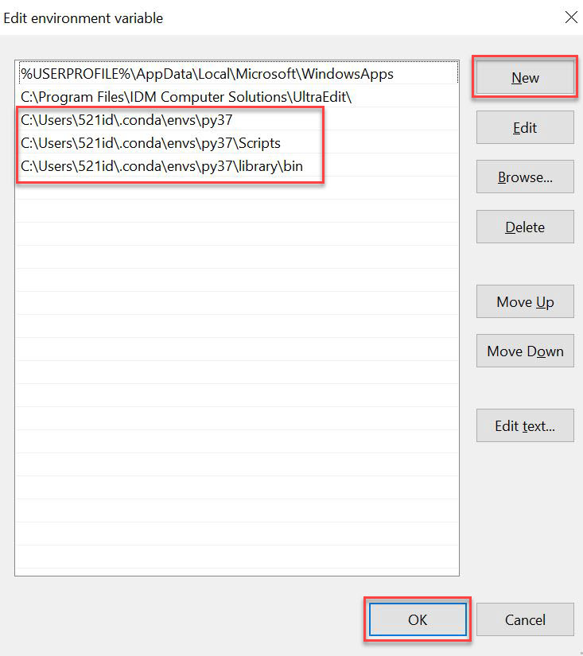

+++
title = "Setup Your Python Environment"
menuTitle = "5. Appendix: Python Environment Setup"
weight = 5
+++

## Prepare software

1. Install the software **Anaconda** through [Novartis Software Self-Service](https://sccm.novartis.intra/esd/)

## Setup proxy servers

1. Create a file named **.condarc** located in the path: C:\Users\521id\

2. Open the file .condarc using Notepad++ or UltraEdit as you like
3. Add below texts into this file (do not remove spaces or indents before "-" and "http")

   >ssl_verify: true
   >
   >channels:
   >
   >&nbsp;&nbsp;- defaults
   >
   >&nbsp;&nbsp;- https://mirrors.tuna.tsinghua.edu.cn/anaconda/pkgs/main/
   >
   >&nbsp;&nbsp;- https://mirrors.tuna.tsinghua.edu.cn/anaconda/pkgs/free/
   >
   >proxy_servers:
   >
   >&nbsp;&nbsp;http: http://ap-cnzj-proxy.ap.novartis.net:2011
   >
   >&nbsp;&nbsp;https: http://ap-cnzj-proxy.ap.novartis.net:2011
   >
   >show_channel_urls: true

4. Save and quit

## Setup your own environment

1. Open **Anaconda Navigator** to create your own environment. (Be patient after clicking _Create_ and remember the environment name)

 
2. Now you can install any application that you needed e.g. Jupyter Notebook, VS Code in your own environment. 
3. Search "**env**" in windows search. Choose _**Edit environment variables for your account**_.

4. Choose _**Path**_, and then click _**Edit**_. Then click _**New**_ to add below environment variables. ("py37" is the environment name which is created in Anaconda Navigator and you can type in your own)

5. Open **Anaconda Prompt (your envr name)**. Install packages using below command lines.

   >pip install \-\-proxy=http://ap-cnzj-proxy.ap.novartis.net:2010 -U flask (package name) \-\-user -i https://pypi.tuna.tsinghua.edu.cn/simple

6. Open **Command Prompt** by press Windows + R and type "cmd". Install packages using below command lines.

   >C:\\Users\521id\\.conda\\envs\\your envr name\\python.exe  -m pip install \-\-proxy=http://ap-cnzj-proxy.ap.novartis.net:2010 -U flask (package name)  \-\-user -i https://pypi.tuna.tsinghua.edu.cn/simple

7. **Keep learning and enjoy coding!**